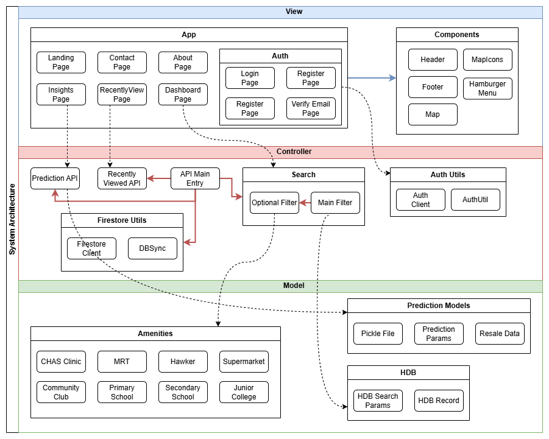

# Smart HDB Finder 🏠

This is the official repository for SC2006 Software Engineering group project **Smart HDB Finder**. Welcome!

Smart HDB Finder helps home buyers narrow down past resale listings efficiently, find homes that fit both their budget and daily routines, and avoid irrelevant listings.

## Table of Contents
- [Project Deliverables](#deliverables)
- [Setup Instructions](#setup-instructions)
  - [Prerequisites](#prerequisites)
  - [Installation](#installation)
  - [Frontend](#frontend)
  - [Backend](#backend)
  - [Scripts](#available-npm-scripts)
- [App Design](#app-design)
  - [Frontend stack](#frontend-stack)
  - [Backend stack](#backend-stack)
  - [Project structure](#sproject-structure)
- [External APIs and Datasets](#external-apis-&-datasets)

## Deliverables
<table>
<tr>
<td width="50%" valign="top">

## 📄 Documentation
1. [SRS Documentation](link-to-srs)
2. [Use Case Descriptions](link-to-use-cases)
3. [UI Mockup](link-to-ui-mockup)
4. [Data Dictionary](link-to-data-dictionary)
5. [Functional & Non-functional Requirements](link-to-requirements)

</td>
<td width="50%" valign="top">

## 📊 Diagrams
1. [Use Case Diagram](link-to-use-case-diagram)
2. [Class Diagram](link-to-class-diagram)
3. [Class Stereotype](link-to-stereotype-diagram)
4. [Sequence Diagrams](link-to-sequence-diagrams)
5. [Dialog Map](link-to-dialog-map)
6. [System Architecture](link-to-system-architecture)

</td>
</tr>
</table>


## Setup Instructions

This guide provides instructions to set up and run the project on your local machine. Follow the steps below to get the application running locally or in your environment.

### Prerequisites
- Git 
- Python
- Node.js

### Installation

1. **Clone the repository**
   ```bash
   git clone https://github.com/Pratz2005/HDB.git
   cd HDB/smart-hdb-finder

2. **Set up configuration files**

   2.1 Create a `.env` file with the following content:

   ```env
   # OneMap API credentials
    ONEMAP_AUTH_URL=
    ONEMAP_AUTH_EMAIL=
    ONEMAP_AUTH_PASSWORD=
    ACCESS_TOKEN=
    TOKEN_EXPIRY_TIMESTAMP=
   # Firebase Auth
    NEXT_PUBLIC_FIREBASE_API_KEY=
    NEXT_PUBLIC_FIREBASE_AUTH_DOMAIN=
    NEXT_PUBLIC_FIREBASE_PROJECT_ID=
    NEXT_PUBLIC_FIREBASE_STORAGE_BUCKET=
    NEXT_PUBLIC_FIREBASE_MESSAGING_SENDER_ID=
    NEXT_PUBLIC_FIREBASE_APP_ID=
    ```

   2.2 Create a `firebase-key.json` file with the following content (in controller/utils):
   ```json
   {
    "type": "",
    "project_id": "",
    "private_key_id": "",
    "private_key": "",
    "client_email": "",
    "client_id": "",
    "auth_uri": "",
    "token_uri": "",
    "auth_provider_x509_cert_url": "",
    "client_x509_cert_url": "",
    "universe_domain": ""
   }
    ```


> **Note:** If application is not working after following the setup instructions, you may need to renew the API keys

### Frontend 

Run the following command to install all necessary dependencies and match the required versions:
```sh
npm install
```

Then, run the development server:
```bash
npm run dev
```
Open [http://localhost:3000](http://localhost:3000) with your browser to see the result.

### Backend

Create a virtual environment (if it has not been created)
```sh
# For Windows
python -m venv venv

# For macOS/Linux
python3 -m venv venv
```

Activate the virtual environment
```sh
# For Windows
venv\Scripts\activate

# For macOS/Linux
source venv/bin/activate
```

Install required packages
```sh
pip install -r requirements.txt
```

### Available NPM Scripts
| Command                | Description                              |
|------------------------|------------------------------------------|
| `npm run dev:api`      | Starts FastAPI backend server            |
| `npm run dev:token`    | OneMap API Token Authentication          |
| `npm run dev:db`       | Tests database connection                |
| `npm run dev:frontend` | Runs website and authenticates token     |


## App Design


### Frontend Stack


### Backend Stack


### 📁 Project Structure
---

#### 📂 Root Directory
```
smart-hdb-finder/
├── package.json               # JavaScript dependencies
├── requirements.txt           # Python dependencies
├── .env, .gitignore           # Environment config and Git settings
```

#### 📂 controller/
Handles backend logic and orchestration.

```
controller/
├── insights/
│   └── predict.py                   # Handles price prediction logic
├── search/
│   ├── mainFilter.py                # Core HDB filtering logic
│   └── optionalFilters.py           # Extra filters: MRT, amenities
├── utils/
│   ├── firebaseClient.py            # Firebase interaction layer
│   ├── OneMap_token_auth.py         # OneMap token handling
│   └── sync_firestore.py            # Syncs data to Firestore
├── fetchRecentlyViewed.py           # Retrieves recent searches
├── main.py                    # API entry point or script runner
```

#### 📂 model/
Contains all data representations and ML model configs.

```
model/
├── amenities/
│   └── CHASClinic.py, MRTStation.py, Supermarket.py, ...  # Amenity data models
├── hdb/
│   ├── HDBRecord.py               # HDB listing data class
│   └── HDBSearchParams.py         # Filtering parameter structure
└── predictionModel/
    ├── model_pipeline.pkl         # Serialized ML pipeline
    ├── PredictionParams.py        # ML config
    └── ResaleData.csv             # Resale data for predictions
```

#### 📂 public/
Static assets used by the frontend.

```
public/
├── *.jpeg, *.png, *.ico           # UI graphics and images
```


#### 📂 src/
Frontend logic and layout (Next.js app).

```
src/
├── app/
│   ├── about-us/, auth/, dashboard/, insights/  # Route folders
│   └── page.js files within for page-specific logic
├── utils/
│   └── authUtil.js, firebaseClient.js           # Utility functions
├── components/
│   └── Reusable UI elements (icons, Header, Footer, Map, etc.)
├── layout.js, globals.css                       # Global styles and layout
```

## External APIs & Datasets
1. [OneMapAPI](https://www.onemap.gov.sg/apidocs/maps): Interactive Map
2. [Firebase](https://firebase.google.com/docs/reference/admin/python): Authentication and Database
3. [Data.gov.sg](https://guide.data.gov.sg/developer-guide/api-overview): Geolocation and Resale Data


